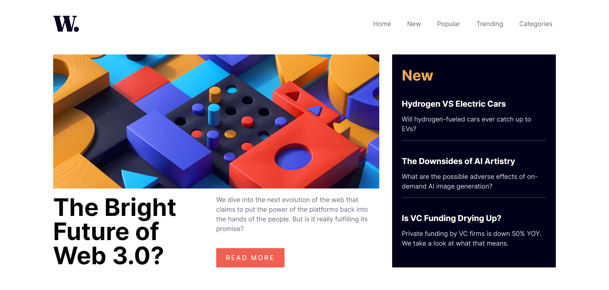

# Frontend Mentor - News Homepage Solution

This is a solution to the News homepage challenge on [Frontend Mentor](https://www./challenges/news-homepage-H6SWTa1MFl).

## The Challenge

Users should be able to:

- View the optimal layout for the interface depending on their device's screen size
- See hover and focus states for all interactive elements on the page
- **Bonus**: Toggle the mobile menu (requires some JavaScript)

## Screenshot

## Links
Live Demo: [Click Here](https://your-live-site-url.com)

## Built with
- [React](https://reactjs.org/) - JS library
- [Tailwind CSS](https://tailwindcss.com/) - For styles

## License
MIT
